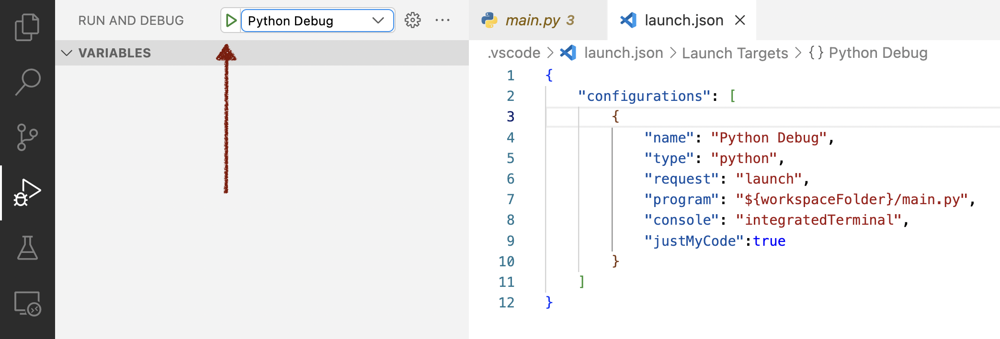
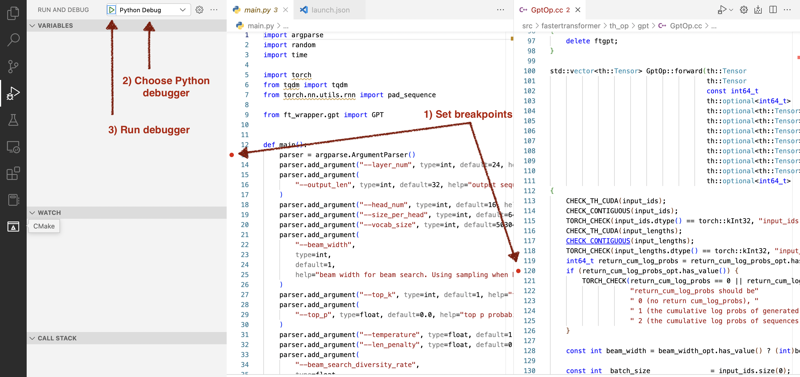
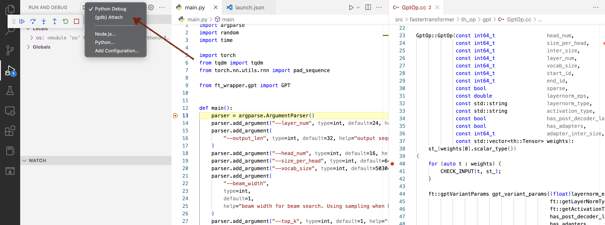
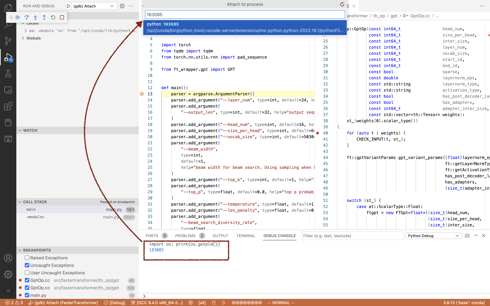
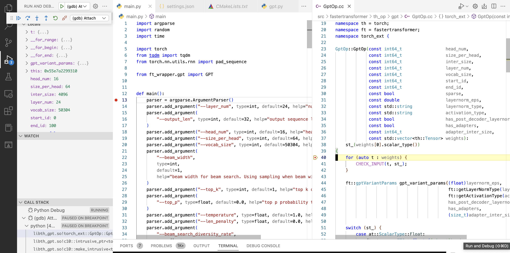
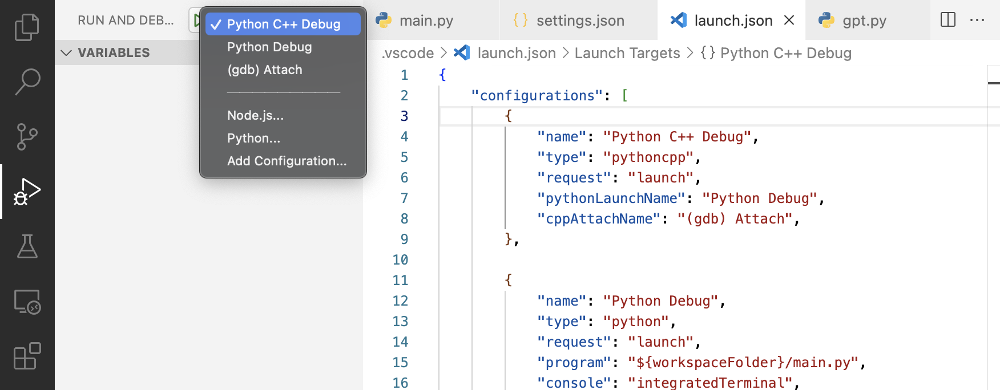

If you working on a Python project, which required high performance you probably will use C++ code embedded into your python application. And you may have a question, how do debug this mixed code? That is easy using VSCode!

> Note: before starting be sure that you have a debugger installed on your system (gdb for Linux or lldb for macOS)

> Note 2: If you debug inside docker container you should allow **ptrace** inside docker container using `cap-add` option: `docker run --cap-add=SYS_PTRACE`

## Making launch.json

VSCode uses `JSON` files to configure everything, so to configure the debugger we should create a `.vscode/launch.json` file in your project folder, to tell the editor how to run your code.

The simplest `launch.json` looks like this:
```JSON
{
    "configurations": [
    ]
}
```
There are no configurations, which means that the debugger launches nothing at the start.

### Python configuration
Let's add Python debugging configuration to the `configurations` list:
```json
{
    "name": "Python Debug",
    "type": "python",
    "request": "launch",
    "program": "${workspaceFolder}/main.py",
    "console": "integratedTerminal",
    "justMyCode": false
}
```

Here we are told that we want to **launch** python program. The `"request": "launch"` parameter is important because the debugger will launch the program at startup.  The `"program": "${workspaceFolder}/main.py",` specifies an entry point python program file, do not forget to set this option `"justMyCode": false`, this option allows you to debug step into the thridparty libraries using the debugger, otherwise you will be able to go through only your code.

If your program needs some arguments to run, you can add them to the configuration.
```json
"args": [
    "--my-arg=test"
]
```

Now you can run and debug your python code using VSCode debugger. To do this, push the green button in the VSCode debug section.


This configuration does now allow debugging C++ code. Let's fix it.

### C++ configuration

Let's add a C++ debugger configuration. 
> Important note: I'm using a Linux machine for debugging, so I will use (GNU) GDB C++ debugger. If you are using macOS you probably want to use LLDB, or MVCC Debugger for Windows, the configuration will be similar excluding debugger names, you may find examples on the internet. 

Example of C++ debugger configuration
```json
{
    "name": "(gdb) Attach",
    "type": "cppdbg",
    "request": "attach",
    "program": "/opt/conda/bin/python3",
    "MIMode": "gdb",
    "processId": "${command:pickProcess}",
    "setupCommands": [
        {
            "description": "Enable pretty-printing for gdb",
            "text": "-enable-pretty-printing",
            "ignoreFailures": true
        },
        {
            "description":  "Set Disassembly Flavor to Intel",
            "text": "-gdb-set disassembly-flavor intel",
            "ignoreFailures": true
        }
    ]
}
```

Configuration is pretty simmilar, but there are three important config parameters: 


The first one, you should select python as a target program to debug `"program": "/opt/conda/bin/python3"` because you C++ code that you use from python is not an `executable`, probably is `.so` or `.dll` shared library file, which used by your python code, which is executed by `python` process. You should provide a full path to your python interpreter. 
> Note: Your system may have multiple python interpreters. You should select the interpreter which runs your python code.

The second one, you should select `"request": "attach"` mode, because the C++ debugger does not launch your program, it's done by the python debugger, and after that C++ debugger will attach to the running process.

The third one, you should specify the actual **process ID** which you want to debug. To do that we should set the `"processId": "${command:pickProcess}"` parameters, this parameter specifies VSCode to show you a dialogue window where you can enter process PID manually after debugger startup.


## Running debugger

Before starting debugging, you need to set some breakpoints in your C++ code, which you want to debug, and breakpoint at the start of your python program.

You need to set a python breakpoint because you should first know your **PID** and attach a C++ debugger to the run python process, and then continue python code execution, otherwise python will just execute your C++ code without breaking.




When the debugger stops on your python breakpoint, type `import os; print(os.getpid())
` in the python debug console, to see the current process id.

Then, **without python debugging sopping** select the C++ debugger in the drop-down menu and run it.


You will see a dialogue window, where you should type the process ID which you saw before. 


Ta-da-da! You may push the continue button and your debugger should stop on the breakpoint in your C++ code.



## Simplifying the debugger running

The process of starting the python debugger, then running C++ debugging, and selecting the process -- may be annoying, to make debugging easier use [Python C++ Debugger](https://marketplace.visualstudio.com/items?itemName=benjamin-simmonds.pythoncpp-debug) plugin for VSCode.


You need just to install this plugin into your VSCode, and then add one more configuration into `launch.json`

```json
{
    "name": "Python C++ Debug",
    "type": "pythoncpp",
    "request": "launch",
    "pythonLaunchName": "Python Debug",
    "cppAttachName": "(gdb) Attach",
}
```

`pythonLaunchName` and `cppAttachName` are just names of C++ and Python configurations that we set up before. 


Now just select **Python C++ Debugger** and run it!



**Thank you for reading.**


If you found any typos, you can creat a pull requset for this [repo](https://github.com/alxmamaev/alxmamaev.github.io).


### Full config listing

```json
{
    "configurations": [
        {
            "name": "Python C++ Debug",
            "type": "pythoncpp",
            "request": "launch",
            "pythonLaunchName": "Python Debug",
            "cppAttachName": "(gdb) Attach",
        },

        {
            "name": "Python Debug",
            "type": "python",
            "request": "launch",
            "program": "${workspaceFolder}/main.py",
            "console": "integratedTerminal",
            "justMyCode":true,
            "args": [
                
            ]
        },

        {
            "name": "(gdb) Attach",
            "type": "cppdbg",
            "request": "attach",
            "program": "/opt/conda/bin/python3",
            "processId": "${command:pickProcess}",
            "MIMode": "gdb",
            "setupCommands": [
                {
                    "description": "Enable pretty-printing for gdb",
                    "text": "-enable-pretty-printing",
                    "ignoreFailures": true
                },
                {
                    "description":  "Set Disassembly Flavor to Intel",
                    "text": "-gdb-set disassembly-flavor intel",
                    "ignoreFailures": true
                }
            ]
        }

    ]
}
```